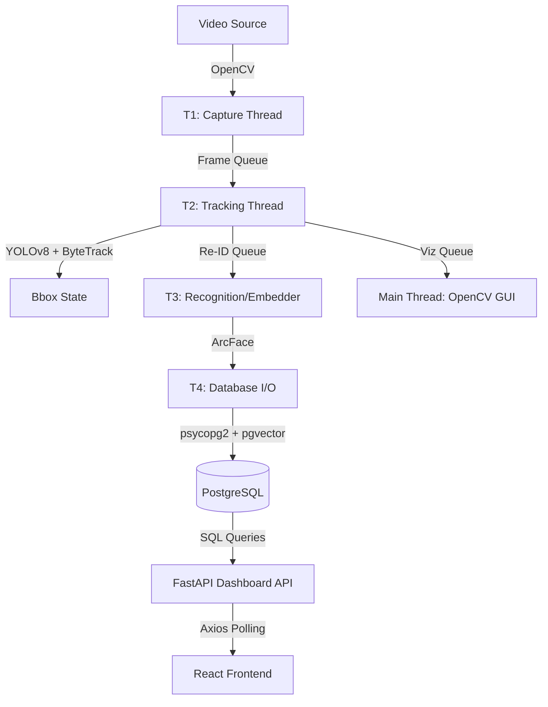

# Intelligent Face Tracker

An advanced face detection, tracking, and re-identification system designed for security monitoring and premises management. The system identifies unique visitors, tracks entries and exits in real-time, and provides detailed visit history through a centralized dashboard.

## Overview

The Intelligent Face Tracker leverages a high-performance multi-threaded pipeline to process high-resolution video streams from RTSP sources or local files. It integrates YOLOv8 for detection and ArcFace for re-identification, using a vector-enabled PostgreSQL database for sub-second visitor matching.

## Key Features

- **Real-Time Pipeline**: Decoupled multi-threaded architecture (Capture, Tracking, Recognition, and I/O) for high-framerate processing.
- **Deep Search Re-ID**: Generates 512-dimensional face embeddings for persistent identity tracking across sessions.
- **pgvector Integration**: Sub-millisecond similarity matching using PostgreSQL's native vector search.
- **State Machine Management**: Automatically handles visitor entry/exit events and visit counts based on configurable temporal persistence.
- **Windows-Optimized Visualization**: Dedicated main-thread OpenCV window showing bounding boxes, track IDs, face IDs, and real-time visitor counts.
- **Premium Web Dashboard**: React-based Glassmorphism interface for statistics monitoring, event log review, and log file management.

---

## Setup Instructions

### 1. Database Configuration

The system requires PostgreSQL (14+) with the `pgvector` extension.

```sql
/* Create database */
CREATE DATABASE face_tracker;

/* Enable vector support */
\c face_tracker;
CREATE EXTENSION IF NOT EXISTS vector;
```

Run the schema initialization:
```bash
psql -d face_tracker -f schema.sql
```

### 2. Backend & Requirements

Install Python dependencies:
```bash
pip install -r requirements.txt
```

Start the API:
```bash
python -m uvicorn api:app --host 0.0.0.0 --port 8001 --reload
```

### 3. Frontend Dashboard

Navigate to the frontend directory:
```bash
cd frontend
npm install
npm run dev
```

The dashboard will be available at `http://localhost:5173`.

---

## Architecture Diagram

The system orchestrates a four-thread pipeline to ensure detection does not block video capture:



## AI Planning & Phases

The development followed a rigorous five-step plan:

1.  **Foundation & Schema**: Established the pgvector database schema and the configuration management system.
2.  **Tracking Pipeline**: Implemented the `T2` worker using YOLOv8-face and ByteTrack for movement consistency.
3.  **Recognition Engine**: Integrated the `T3` worker using InsightFace embeddings to perform database-level similarity matching.
4.  **Backend & Visualization**: Built the main-thread GUI loop for Windows and the FastAPI service for frontend communication.
5.  **Analytics & UI**: Developed the React dashboard with real-time statistics, downloadable logs, and session-based analytics.

---

## Technical Assumptions

1.  **Operating System**: To maintain GUI responsiveness, the live visualization window must run on the Python main thread (Windows requirement).
2.  **Database Persistence**: The system assumes the PostgreSQL database is reachable on the port specified in `config.json` (Default: 6432).
3.  **Video Quality**: Re-registration is only performed for faces meeting the `min_registration_blur_score` and `min_registration_face_size_px` to ensure database accuracy.
4.  **Hardware Acceleration**: While runtime is optimized for CPU, CUDA is utilized automatically if available for YOLOv8 and InsightFace.

---

## Full config.json Reference

```json
{
  "video": {
    "source": "rtsp://localhost:8554/stream",
    "frame_skip_interval": 3,
    "rtsp_reconnect_delay_s": 5,
    "rtsp_max_retries": 10,
    "roi_margin_px": 0
  },
  "detection": {
    "yolo_model_path": "yolov8n-face.pt",
    "yolo_confidence": 0.35,
    "yolo_input_size": 0,
    "yolo_num_threads": 10,
    "min_face_size_px": 20,
    "person_confidence": 0.4,
    "min_person_size_px": 50,
    "min_registration_face_size_px": 45
  },
  "quality_gate": {
    "min_blur_score": 30.0,
    "max_head_angle_deg": 65
  },
  "reid": {
    "insightface_model": "buffalo_l",
    "similarity_threshold": 0.38,
    "reid_every_n_frames": 5,
    "embedding_avg_samples": 2,
    "reentry_window_s": 300,
    "reentry_max_buffer": 200,
    "min_registration_blur_score": 50.0,
    "min_registration_face_size_px": 45
  },
  "tracking": {
    "tracker": "bytetrack",
    "max_track_age_frames": 90,
    "min_entry_frames": 2,
    "n_init": 1,
    "entry_line_y": 0,
    "exit_line_y": 99999
  },
  "database": {
    "host": "localhost",
    "port": 6432,
    "dbname": "face_tracker",
    "user": "postgres",
    "password": "",
    "pool_min": 2,
    "pool_max": 5
  },
  "system": {
    "use_gpu": false,
    "log_dir": "logs/",
    "frame_queue_size": 4,
    "show_visualization": true
  }
}
```

---

## Explanatory Video

[Please insert your Loom or YouTube project demonstration link here](INSERT_LINK_HERE)

---

This project is a part of a hackathon run by https://katomaran.com
